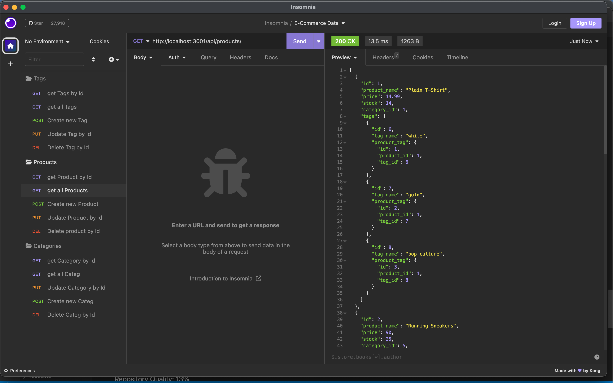

# E-Commerce-Back-End

## Description
This application will help you gather all the information about your business. It was created with the latest technologies for you to be able to compete with other e-commerce applications. 

## Table of Contents 

- [Installation](#installation)
- [Credits](#credits)
- [License](#license)
- [Questions](#questions)

## Installation 

You will have to follow this steps to properly use this application:
Install the npm packages by running the command  `npm init -y` in your terminal.
Then you will connect to mysql2 using the command `mysql -uroot -p` you will be asked to enter your password.
Once you are connected you will run the command `SOURCE schema.sql` to create the Database.
Once you have confirmation of the database has been created you will run the command `npm run seed`
Lastly, you will run `node server.js` to be able to see the data related to the routes on Insomnia or similar apps. 

## Credits

I've used all the material provided in class.

## License
None.

## Links

GitHub repo:https://github.com/caroHagg/E-Commerce-Back-End

